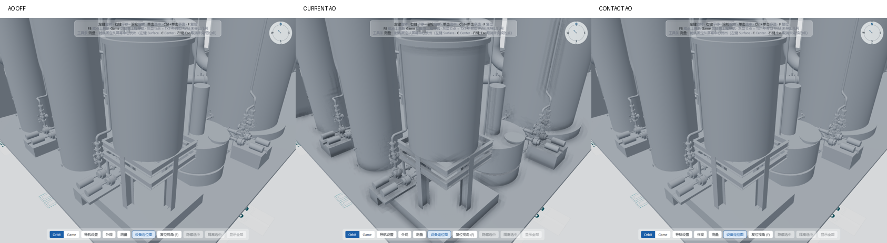

# AO 局部接触增强优化

基于现有 AO 完成参数和合成策略优化，没有更换算法，没有修改 BatchRenderingManager、Selection 或颜色覆盖架构。PBR 光源、材质参数和曝光均保持不变。

## 主要变化

| 项目 | 优化前 | 优化后 |
|---|---|---|
| Radius | 模型对角线 × 0.006，最高 2 m；site 实际约 1.45 m | 固定默认 **0.12 m / 12 cm**，不再随整套模型放大 |
| 默认 Intensity | 0.65 | **0.30** |
| 衰减 | 前 1/4 半径衰减较弱 | `(1 - distance/radius)²`，超出半径立即归零 |
| 采样位置 | 16 点螺旋，偏向外圈 | 仍为 16 点螺旋，更多采样落在近邻 |
| AO 分辨率 | 宽高各一半，四点加权上采样 | **与主画面同分辨率，无 Blur、无上采样** |
| 深度 | HalfFloat 线性深度 | 读取同一次共享预处理的硬件深度附件，避免小尺度接触被线性半精度量化吞掉 |
| 像素重建 | 连续采样坐标与最近邻深度可能不一致 | 重建坐标对齐真实纹理像素中心，去除斜平面的假遮蔽 |
| 极小影响 | 微弱误差也可能量化成暗色 | 阈值抑制弱噪声；投影半径不足 1 像素时淡出 |
| 最终暗化上限 | 45% 线性颜色 | **18%**；默认强度下上限 15%，实际接触通常更低 |

高级参数放在现有光影分组的折叠项“AO 高级设置 → 接触范围”，可调 2–50 cm。普通界面仍只有开关和强度。

`aoRadius` 保存到现有外观 localStorage，跨模型保留，恢复默认外观重置为 12 cm。沿用本次开始时的 AO 默认关闭状态；用户已保存的开关保留。旧设置若仍是旧默认强度 0.65 且没有 Radius，则迁移为 0.30；其他自定义强度保留。

## 模型与辅助显示隔离

- Background：共享缓冲的背景标记为 0，合成因子保持 1。
- Ground：已有 `nonSelectable` 标记转为负深度保护，不接收 AO，也不作为 AO 遮挡样本。
- FloorPlan / Measurement：AO 开启时，基础颜色渲染暂时排除这两个现有组；AO 原位乘法合成后，使用原场景深度绘制辅助组。保留原有深度测试、透明混合、对象身份与父节点，不复制 Mesh 或材质。
- Orientation Gizmo：继续使用独立画布，完全不进入主后处理。
- Selection / Hover / Ghost：沿用已有负深度保护，选中描边仍在后面叠加。

新增 `AOOverlayPass` 只绘制现有两个小型辅助组，没有额外渲染整个模型。AO 与 Edge 仍共用一次模型 Normal/Depth 预处理。关闭 AO 时恢复原基础绘制路径，辅助 pass 跳过。

## 同视角对比

四个固定视角：全模型、设备区、结构区、罐体连接近景。每个视角对比 AO OFF、旧版 AO、优化版 AO；灯光、颜色、模型、相机保持一致。

旧版算法保留为仅测试使用的 fixture，浏览器测试临时加载，产品不引用。全模型、设备区、结构区的旧版 fixture 截图与修改前截图逐像素一致；这三个视角修改前后 AO OFF 截图也逐像素一致。

近景对比图：

可见旧版在罐体下部、平台和邻近设备之间形成宽灰带；优化版保持设备轮廓和 PBR 明暗，接触增强集中在较短距离。

| 近景指标，8-bit RGB | 旧版 | 优化版 |
|---|---:|---:|
| 相对 AO OFF 的全图平均变暗 | 3.502 / 255 | 0.046 / 255 |
| 任意通道变暗超过 2 的像素占比 | 23.769% | 0.662% |
| 每像素 RGB 平均变暗的第 99 百分位 | 38.0 | 1.667 |

这些值是固定截图的辅助证据，不是通用画质分数。远景中 12 cm 接触常不足一个像素，此时优化版与 AO OFF 基本一致，这是有意保留清晰度的取舍。并非要让所有视距都看见阴影。

## 验证

- 接触专项：独立斜平面 AO 全白；相交角部有有效 AO；远离接触的平面不变暗；83,468 个受保护表面像素无暗化；160,000 个辅助图形像素与 AO OFF 完全一致；偏好迁移；Radius 保存与共享深度；高级滑块、刷新/换模型和恢复默认。
- 光影回归 8/8：共享预处理、Selection / Hover、Game / Orbit、Resize / DPR 1.5、保存和重置。
- 颜色与地板 12/12、树/属性/显隐交互 15/15、测量 64/64；这三组测试显式开启 AO + Edge。
- 页面与 WebGL 错误为 0。

AO 的工作方式仍是屏幕空间近似，无法感知屏幕外或完全遮挡的结构。当前算法已能在小尺度保持清晰，因此本次不引入 SSAO / SAO / GTAO 替换或新的去噪系统。

## 性能检查

RTX 4060 Laptop GPU，WebGL2，实际绘制区 1124×856 / DPR 1。固定全模型 Orbit 视角，无选中；各状态预热 2 秒、采样 16 次取中位数，本次性能测试独立运行。

| 模型 | AO / Edge | FPS | GPU ms | 主场景 / 总 calls |
|---|---|---:|---:|---:|
| site | OFF / OFF | 165 | 2.23 | 398 / 399 |
| site | ON / OFF | 122 | 5.49 | 398 / 506 |
| site | OFF / ON | 123 | 5.64 | 398 / 505 |
| site | ON / ON | 122 | 6.41 | 398 / 507 |
| hygq | OFF / OFF | 126 | 2.07 | 321 / 322 |
| hygq | ON / OFF | 62 | 10.84 | 321 / 641 |
| hygq | OFF / ON | 63 | 9.49 | 321 / 640 |
| hygq | ON / ON | 63 | 10.96 | 321 / 642 |

主场景和总绘制次数与上一版对应模式一致，AO + Edge 没有重复渲染模型。提高 AO 分辨率主要增加像素处理及目标内存，不承诺性能提升；在现有 Edge 上叠加 AO 的 GPU 增量约 0.77 / 1.47 ms。远景数据不能代表近景大量接触像素的最坏耗时，高 DPR 或较弱 GPU 仍可关闭 AO。FPS 受桌面负载和刷新率影响，原始数据见 `evidence/ao-contact-benchmark.json`。

## 文件

- `viewer/js/ambientOcclusionPass.js`：采样、衰减、全分辨率、原位合成。
- `viewer/js/normalDepthPass.js`：同一共享目标的可采样硬件深度附件。
- `viewer/js/aoOverlayPass.js`（新增）：辅助显示保护。
- `viewer/js/viewer3d.js`：接线和 Radius 生效，取消随模型尺寸扩大半径。
- `viewer/js/appearance.js`、`viewer/app.js`、`viewer/index.html`：默认值、兼容读取、折叠高级设置。
- `scratch/ao-contact-*`：比较、图像统计、专项与回归测试；`scratch/ao-legacy.js`：旧版算法测试 fixture；`scratch/lighting-verify.js`：更新到当前默认值及分辨率约定。

原始结果保存在 `reports/evidence/ao-contact-*.json`，原始截图及四组三列对比图同目录。
